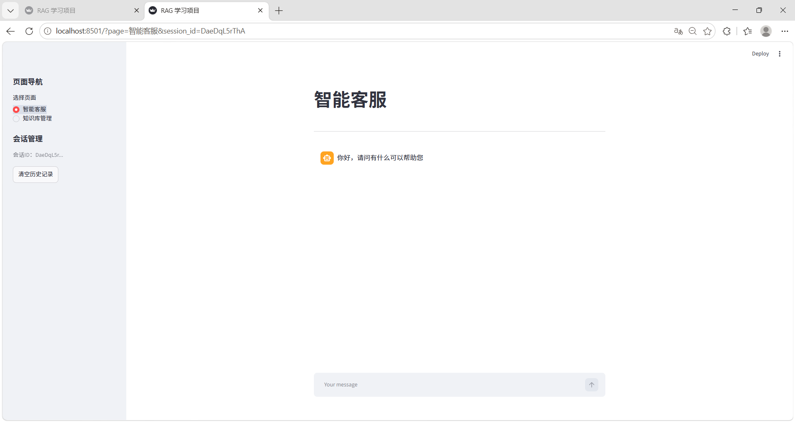
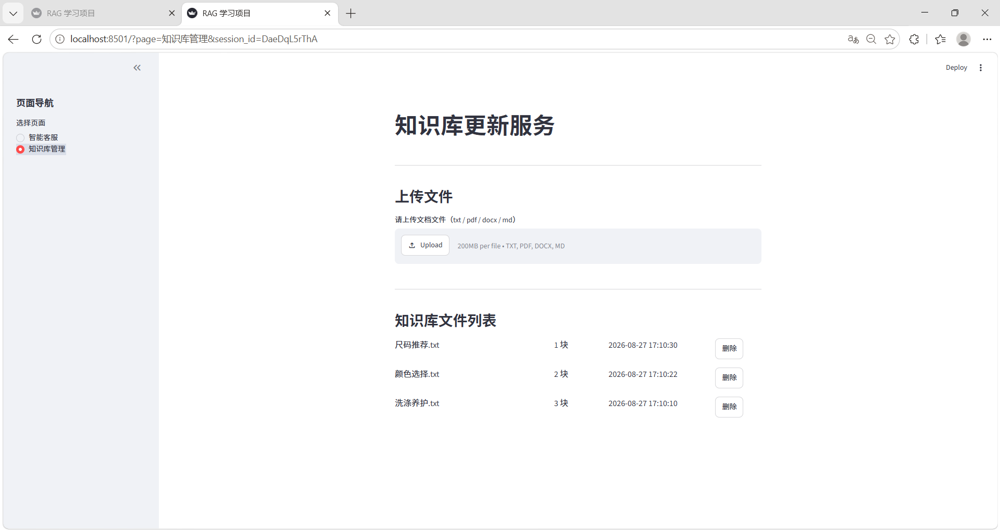
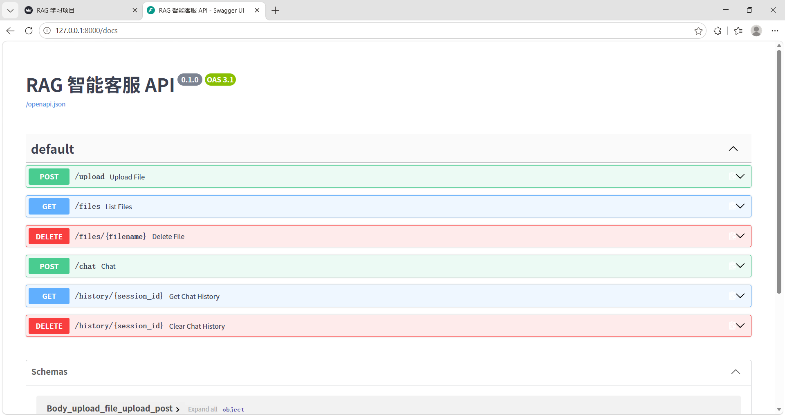

# 智能客服助手 —— 基于 LangChain 的服装电商 RAG 系统

> **在线体验**：https://yinyiwang-rag.streamlit.app
>
> 首次访问需输入访问口令；首次提问要下载嵌入模型（约 2.3GB），请耐心等待 1-2 分钟。

## 一、项目简介

本项目实现一套面向服装电商场景的 RAG 智能客服原型系统。将服装尺码、搭配、商品说明等文档构建本地知识库，接收用户自然语言提问，基于检索结果生成回答，并返回知识来源溯源。

核心特点：

- 需求信息不全时**主动追问**（如问尺码缺身高体重），而非瞎猜硬答
- 知识库未覆盖时**兜底转人工**，不编造答案
- 全程可观测：答案附参考来源文件；历史会话按用户隔离、上限裁剪
- 完备质量体系：69 项自动化测试（含页面 AppTest 模拟交互、真实 LLM 问答链路）+ 20 题人工标注评测集覆盖主要咨询场景

问答主流程：

```
用户提问 → 查询改写(LLM) → 意图闸门(模糊则追问) → 阈值检索 → 兜底/带历史生成 → 溯源展示
```

## 二、技术栈

| 层 | 技术 |
|---|---|
| 应用框架 | LangChain 1.x（RunnableWithMessageHistory / Chroma / 阈值检索器） |
| 嵌入模型 | BAAI/bge-m3（本地离线加载，归一化后检索分数 = 余弦相似度） |
| 向量库 | Chroma（本地持久化） |
| LLM | DeepSeek（OpenAI 兼容接口） |
| 前端 | Streamlit |
| API | FastAPI + Uvicorn |
| 环境 | Python 3.12 / Windows（本地）/ Linux（云端） |

## 三、功能演示

**1. 智能客服页（`app.py` → 侧边栏选"智能客服"）**

- 口语提问 → 带溯源回答：答案下方展示参考来源文件
- 信息不全 → 主动追问（如"帮我搭配一套衣服"会先问性别/身高/场合）
- 无关问题 → 兜底转人工提示
- 会话管理：刷新页面历史保留；"清空历史记录"按钮



**2. 知识库管理页（侧边栏选"知识库管理"）**

- 上传 txt / md / pdf / docx，实时显示"成功/跳过/失败"三色提示
- 文件列表（块数、上传时间）+ 一键删除（同步清理向量与去重记录）



**3. FastAPI 接口（`api.py`）**

6 个接口：上传 / 文件列表 / 删除 / 问答 / 历史查询 / 清空历史，启动后访问 `http://127.0.0.1:8000/docs` 交互调试。



### 项目目录结构（GitHub 仓库内容）

```
智能客服助手/
├── app.py                  # Streamlit 入口（访问门禁 + 知识库自举 + 侧边栏导航）
├── chat_page.py            # 智能客服页（会话管理/历史还原/溯源展示）
├── kb_page.py              # 知识库管理页（上传幂等/列表/删除）
├── rag.py                  # 问答服务（改写→追问→检索→兜底/生成）
├── knowledge_base.py       # 知识库服务（三层去重/文件管理）
├── data_pipeline.py        # 数据管线（解析/清洗/分割/chunk 指纹）
├── vector_stores.py        # 向量库封装（阈值检索器）
├── embeddings.py           # 嵌入模型共享单例（全应用只加载一次）
├── file_history_store.py   # 会话历史文件存储（8 条裁剪）
├── config_data.py          # 集中参数配置（含本地/云端环境自适应）
├── api.py                  # FastAPI 服务（6 接口）
├── .streamlit/
│   └── secrets.toml.example  # 密钥配置模板（真值 secrets.toml 不入库）
├── README.md               # 项目文档（本文件）
├── requirements.txt        # 依赖清单（显式锁定 CPU 版 torch，避免云端拉 CUDA 版）
├── data/                   # 知识文档原件（首次使用上传入库）
├── docs/                   # 演示截图
└── 测试脚本/               # 测试与评测
    ├── test_suite.py       # 69 项功能测试（8 组）
    ├── eval_set.py         # 20 题人工标注评测集
    └── eval_recall.py      # recall@k 评测脚本（结果写入本地 eval_baseline.txt，不入库）
```

> 不入库的运行时产物：`chroma_db/`（向量库，首次使用重新入库）、`chat_history/`（会话数据）、`md5.text`（去重记录，自动生成）、`.env`（密钥，见环境部署）。

## 四、环境部署

### 本地运行

```bash
# 1. 安装依赖（本项目实测环境：Python 3.12.10）
pip install -r requirements.txt

# 2. 创建 .env 密钥文件
# 本项目约定 .env 放在项目根目录 RAGProject/（智能客服助手 的上一级）
# .env内容：
# DEEPSEEK_API_KEY=你的key
# OPENAI_API_BASE_URL=https://api.deepseek.com

# 提示：如果想把 .env 放在应用目录内，需要修改代码中读取 dotenv 的文件路径

# 3. 启动页面
cd 智能客服助手
python -m streamlit run app.py
# 浏览器访问 http://localhost:8501

# 4. 首次使用：
#    启动后进入"知识库管理"页，上传 data/ 目录下的 3 个知识文件完成入库

# 5. 启动 API
python -m uvicorn api:app --port 8000
```

### 云端部署（Streamlit Community Cloud）

代码已内置本地/云端自适应，部署时**无需改动任何代码**：

| 环节 | 本地 | 云端 |
|---|---|---|
| 嵌入模型 | 读 `D:/huggingface_cache`，强制离线加载 | 自动联网下载到默认缓存目录 |
| 密钥来源 | 上级目录 `.env` | 平台 Secrets（`config_data.get_secret` 依次尝试两者） |
| 知识库 | `chroma_db/`（已入库） | 首次启动自动把 `data/` 下文档灌入（`chroma_db/` 不入库） |
| 访问控制 | 不启用 | 配置 `APP_PASSWORD` 后启用口令门禁 |

部署步骤：

1. 推送代码到 GitHub（`.env`、`chroma_db/`、`.streamlit/secrets.toml` 均已在 `.gitignore` 中排除）
2. Streamlit Cloud → New app → 选择仓库，**Main file path 填 `app.py`**
3. 高级设置里 **Python 版本选 3.12**（与本地实测版本一致）
4. App settings → Secrets，按 `.streamlit/secrets.toml.example` 的格式填入 `DEEPSEEK_API_KEY`、`OPENAI_API_BASE_URL`、`APP_PASSWORD`
5. 首次打开会显示"正在构建知识库"，模型下载 + 文档入库需几分钟；之后每次冷启动都会重建（云端文件系统随容器重置）

> **资源提示**：bge-m3（fp32）常驻内存约 2.3 GB，Streamlit Cloud 免费层内存有限，可能出现 OOM 重启。若遇到，可改用 Hugging Face Spaces —— 免费层 16 GB 内存，同样是 Streamlit SDK、同样运行 `app.py`，代码无需改动。

### 常见问题
1. bge‑m3模型加载慢 / OOM：首次运行会下载模型，建议机器可用内存 ≥4G；
2. DeepSeek接口报错：检查.env的API_KEY是否正确，网络是否可以访问deepseek接口；
3. streamlit页面重复执行上传逻辑：本项目已经做file_id幂等处理，如果仍异常请升级streamlit版本；
4. Chroma数据库损坏：删除 `./chroma_db` 文件夹，重新上传知识库文档；
5. 云端部署后所有提问都返回兜底文案：说明知识库没建起来，检查启动日志里 `_seed_knowledge_base` 是否报错，以及 `data/` 下 3 个 txt 是否随仓库推送；
6. 云端出现"请输入访问口令"：口令就是你配置在 Secrets 里的 `APP_PASSWORD`，没配就不该出现这个框；
7. 本地启动卡住不动：检查 `D:/huggingface_cache` 是否存在 —— 存在才会启用离线模式，不存在会转为联网下载。


## 五、项目难点与优化点

| 难点 | 解决方案 | 验证 |
|---|---|---|
| 用户问题模糊（"帮我搭配衣服"）模型会瞎猜 | 检索前加**意图闸门**：模糊则主动追问关键信息，追问轮数上限防死循环 | 对比实验：无追问时给"白衬衫+黑西裤"错误答案；有追问后补充信息回答正确 |
| 重复上传污染知识库 | **三层去重**：文件级 md5（整文件跳过）→ 同名不同内容（替换旧版）→ chunk 级哈希（跳过重复块） | 69 项测试 B 组 16 项覆盖三态 |
| 检索阈值拍脑袋设置 | 用真实语料**实测标定**（相关 ≥0.44 / 无关 ≤0.11，取 0.30），并用参数对比实验验证取值合理性 | 参数对比实验 + 失败题归因，定位为阈值误杀 |
| 上下文窗口无限膨胀 | 会话历史**8 条滚动裁剪**，只保留最近消息 | 测试验证达上限后写入仍保持 8 条且内容更新 |
| 多用户会话混淆 | session_id 通过 URL 参数传递，复制 / 刷新页面会话不丢失，多浏览器标签天然隔离不同用户会话 | 页面层 AppTest 8 项验证 |
| 嵌入模型重复加载内存翻倍 | `embeddings.py` **共享单例**：全应用只加载一次（约 2GB） | 一致性测试验证同一实例 |
| 页面重跑导致重复上传 | 上传以控件 `file_id` 作指纹**幂等处理**：rerun 不重传，删后重传正常 | 页面层测试验证 |
| 改代码/调参导致效果退化 | **69 项功能测试 + 20 题人工标注评测集**双重回归 | 全量测试与评测脚本一键重跑 |

## 六、后续改进方向

1. **会话持久化迁移**：当前使用`RunnableWithMessageHistory`实现会话管理；后续计划迁移至 LangGraph 持久化方案，适配生产场景。
2. **用户体系**：引入登录 + 服务端会话列表，替换"URL 携带 session_id"的简化方案
3. **向量库升级**：本地 Chroma → 服务化向量库（Milvus / Qdrant），支持海量文档与高并发
4. **检索增强**：混合检索（BM25 + 向量）、Rerank 精排，进一步提升复杂查询的召回
5. **评测体系扩展**：引入 RAGAS（faithfulness / answer relevance 维度），评测集随知识库扩充持续补题
6. **工程化部署**：Docker 容器化、配置中心管理密钥、日志与监控
